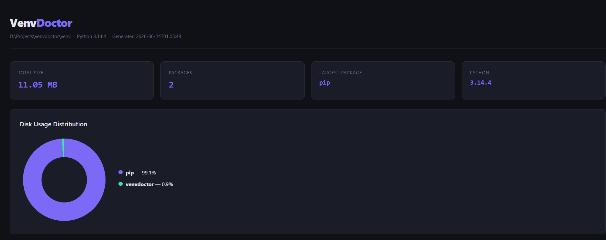
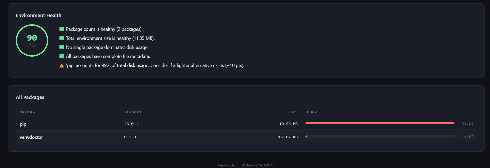
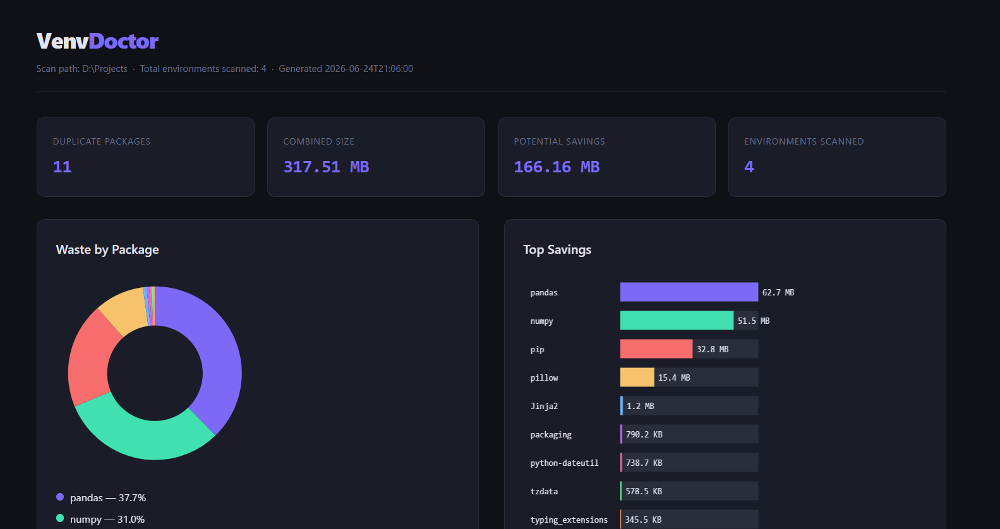
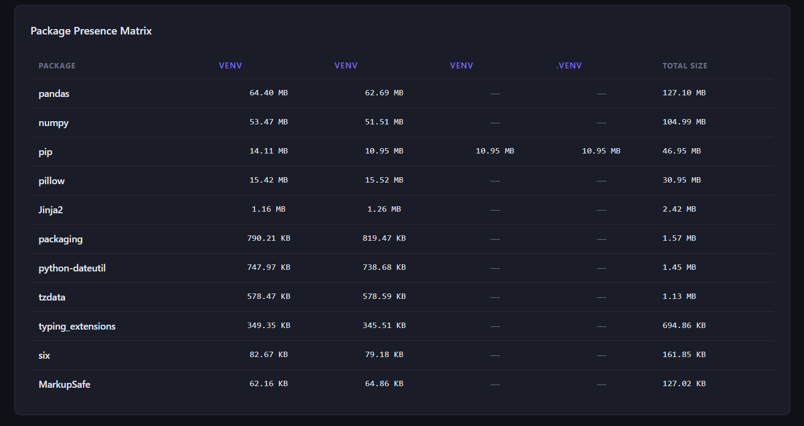

# VenvDoctor 🩺

**Analyze, visualize, and optimize Python virtual environments.**

VenvDoctor is a command-line utility that helps Python developers understand virtual environment storage usage, inspect package dependencies, detect outdated packages, discover duplicate packages across environments, and generate interactive reports.

Whether you're working with machine learning projects, data science workloads, web applications, or dozens of development environments, VenvDoctor helps answer one simple question:

> **Where is my disk space going?**

---

# Why VenvDoctor?

Python virtual environments are essential for dependency isolation, but they often become invisible storage consumers.

A typical development machine may contain:

* Multiple virtual environments
* Duplicate copies of large packages
* Unused environments consuming gigabytes of storage
* Outdated packages
* Hidden dependency bloat

Traditional tools such as:

```bash
pip list
pip show
pip freeze
```

provide package information, but they don't help you understand:

* Storage usage
* Package size distribution
* Cross-environment duplication
* Dependency impact
* Environment-level analytics

VenvDoctor fills that gap.

---

# Key Features

## Environment Analytics

* Analyze active virtual environments
* Analyze any virtual environment by path
* Calculate package-level storage usage
* Identify the largest packages
* Measure total environment size

## Dependency Intelligence

* Dependency tree visualization
* Dependency impact analysis
* Package inspection
* Package metadata analysis

## Reporting & Visualization

* JSON export
* CSV export
* Interactive HTML dashboards
* Storage distribution charts
* Duplicate package dashboards

## Multi-Environment Analysis

* Scan directories for virtual environments
* Detect duplicate packages
* Estimate recoverable storage
* Compare environments
* Cleanup recommendations

## Package Maintenance

* Detect outdated packages using the PyPI API
* Review installed vs latest versions

---

# Screenshots

## Environment Dashboard





---

## Duplicate Storage Dashboard






---

# Installation

## From Source

```bash
git clone https://github.com/venkat24k/venvdoctor.git

cd venvdoctor

python -m venv venv

venv\Scripts\activate

pip install -e .
```

---

# Quick Start

## Analyze Current Environment

```bash
venvdoctor
```

Example:

```text
VenvDoctor
==================================================

Python Version    : 3.14.4
Environment Path  : D:\Projects\venvdoctor\venv

Installed Packages: 42
Environment Size  : 4.62 GB

Top Packages By Disk Usage
==================================================

torch                 3.24 GB (70.1%)
tensorflow            1.12 GB (24.2%)
numpy               148.27 MB (3.2%)
```

---

# Commands

## Show Top Packages

```bash
venvdoctor --top 5
```

Display the largest packages by disk usage.

---

## Analyze Any Virtual Environment

```bash
venvdoctor --venv "D:\Projects\MLProject\venv"
```

Analyze a virtual environment without activating it.

---

## Export JSON

```bash
venvdoctor --json
```

Generate machine-readable output.

Example:

```json
{
  "package_count": 42,
  "environment_size": "4.62 GB"
}
```

---

## Generate Reports

### JSON Report

```bash
venvdoctor --report report.json
```

### CSV Report

```bash
venvdoctor --report report.csv
```

### HTML Dashboard

```bash
venvdoctor --html dashboard.html
```

Generates an interactive dashboard showing:

* Environment summary
* Package count
* Largest package
* Storage distribution
* Package usage table

---

## Dependency Tree

```bash
venvdoctor --tree
```

Example:

```text
pandas
├── numpy
├── python-dateutil
└── pytz
```

---

## Package Inspection

```bash
venvdoctor --package numpy
```

Displays:

* Version
* Size
* Installation location
* Dependencies
* Package summary

---

## Dependency Impact Analysis

```bash
venvdoctor --largest-deps
```

Ranks packages by:

```text
Own Size + Dependency Size
```

Useful for identifying packages that indirectly contribute large storage costs.

---

## Outdated Package Detection

```bash
venvdoctor --outdated
```

Example:

```text
Package             Installed    Latest

pip                   26.0.1     26.1.2
```

---

# Multi-Environment Analysis

One of VenvDoctor's most powerful capabilities.

---

## Scan for Virtual Environments

```bash
venvdoctor scan "D:\Projects"
```

Example:

```text
Found 4 Virtual Environment(s)

NLP\venv                 4.62 GB
streamlit_practice\venv  333.36 MB
venvdoctor\venv           11.05 MB

Total Storage Used: 4.97 GB
```

---

## Duplicate Package Detection

```bash
venvdoctor scan "D:\Projects" --duplicates
```

Example:

```text
numpy installed in 2 environments
Potential save: 51.51 MB

pandas installed in 2 environments
Potential save: 62.69 MB
```

This helps identify package duplication across multiple environments.

---

## Duplicate Storage Dashboard

Generate a visual dashboard showing duplicate package usage.

```bash
venvdoctor scan "D:\Projects" --duplicates-html duplicates.html
```

The dashboard includes:

* Duplicate package count
* Combined duplicate storage
* Potential storage savings
* Duplicate distribution charts
* Package presence matrix
* Detailed duplicate package breakdown

Example insights:

```text
Duplicate Packages : 11
Combined Size      : 317.51 MB
Potential Savings  : 166.16 MB
Environments       : 4
```

---

## Cleanup Recommendations

```bash
venvdoctor scan "D:\Projects" --cleanup
```

Example:

```text
Cleanup Candidates

old_ml_project\venv
Size: 4.8 GB
Last Modified: 180 days ago
```

Custom threshold:

```bash
venvdoctor scan "D:\Projects" --days-old 60
```

---

# Architecture

```text
User
 │
 ▼
CLI Interface (cli.py)
 │
 ├── Package Analyzer
 │     └── package_analyzer.py
 │
 ├── Dependency Analysis
 │     └── tree.py
 │
 ├── Outdated Package Checker
 │     └── outdated.py
 │
 ├── Multi-Venv Scanner
 │     └── scanner.py
 │
 ├── HTML Dashboard Generator
 │     └── formatters.py
 │
 └── Duplicate Dashboard Generator
       └── formatters_duplicates.py

                │
                ▼

       Python Virtual Environments
```

---

# Technology Stack

* Python 3.10+
* argparse
* pathlib
* importlib.metadata
* json
* csv
* concurrent.futures

---

# Roadmap

## Planned

Future Enhancements

- Environment comparison
- Interactive dashboard mode
- Export duplicate analysis to JSON/CSV

---

Built to help developers understand, manage, and optimize Python virtual environments.
